# Manual Split-Flap Display
Welcome to the Manual Split-Flap Display project! Below you can see the 3D models and the physical prototype of this fully mechanical design. **Please note that in some renders and CAD screenshots, only 2 flaps are shown for demonstration purposes to allow a clearer view of the internal mechanism. The final, complete assembly contains all 10 flaps.**

| | |
|:---:|:---:|
| 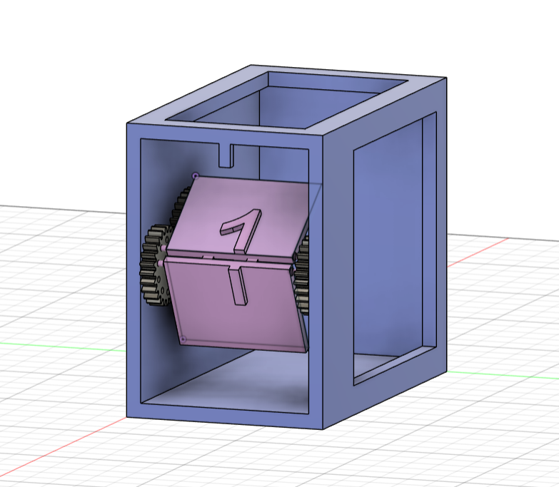 | 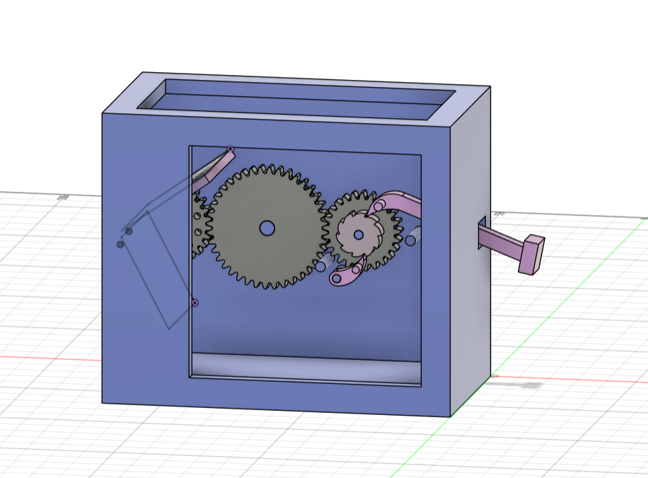 |
| 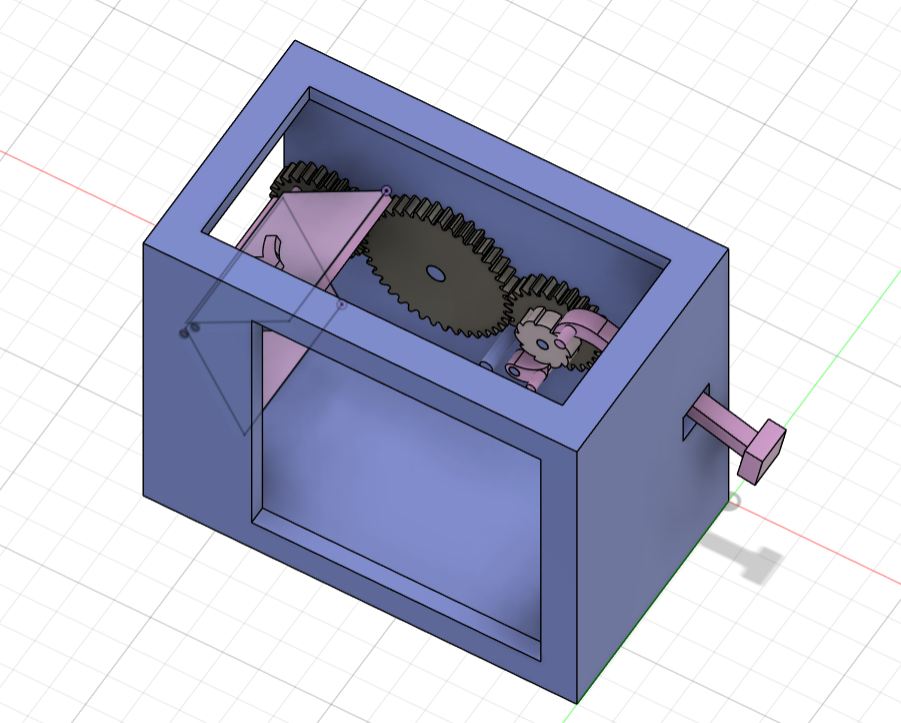 |  |

🎥 **Project Video:** (https://youtu.be/XYKOU2_SeqI)

---

## Project Idea

This project consists of a manually operated split-flap display inspired by old train station and airport information boards.
The mechanism is designed entirely in Fusion 360 and optimized for 3D printing.
Instead of using motors or electronics, the display advances manually through a push-button mechanism that flips the next panel each time the button is pressed.

The display features:
* Numbers from 0 to 10
* A mechanical indexing and flipping system
* A compact, fully 3D printable assembly

---

## How It Works

The project uses a rotating drum containing multiple flaps. Each flap has a printed number or symbol.
When the user presses the button:
1. The kinematic mechanism rotates by a fixed angle (one full step).
2. The current flap is released from the stopper and falls forward.
3. The next number becomes visible and is locked in a perfectly vertical position.

---

## Objectives

* Design a functional split-flap mechanism in Fusion 360
* Create 3D components optimized for printing tolerances
* Implement a reliable manual step-by-step flipping mechanism
* Minimize the number of non-printable components
* Achieve precise and repeatable flap alignment

---

## Technical Details

* **Printing Material:** PETG, chosen for its mechanical wear resistance and the necessary flexibility for components under tension.
* **Project Structure (CAD):** Each component was modeled individually using a *Part Design* approach. The final project was consolidated into an *Assembly Design* to validate geometric constraints and kinematics by precisely defining motion joints.

---

## Main Components List

1. Main gear
2. Second gear
3. Third gear
4. Ratchet
5. Pawl
6. Arm button
7. Flap
8. Case

---

## Component Descriptions

| 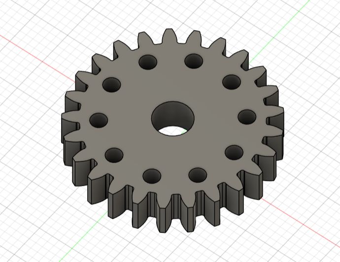 | 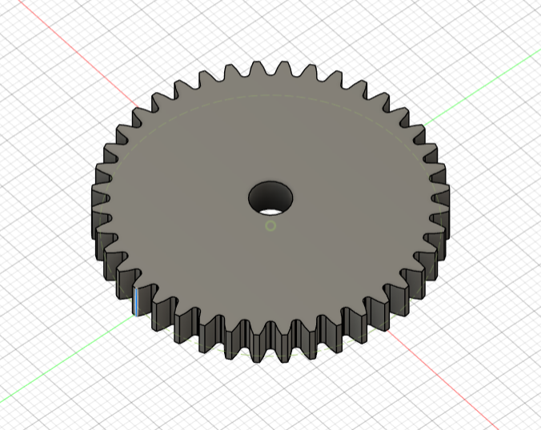 |
|:---:|:---:|
| **Main Gear:** A primary gear equipped with 25 teeth for transmitting rotational motion. The structure integrates 10 radial slots spaced at equal angles, used as mounting and rotation points for the flap axes. | **Second Gear:** A 40-tooth intermediate gear responsible for transferring mechanical torque from the *third gear* to the *main gear*. The transmission ratio is strictly defined to ensure an exact 36-degree rotation per actuation (the angle required to sequentially index the 10 flaps). |

| 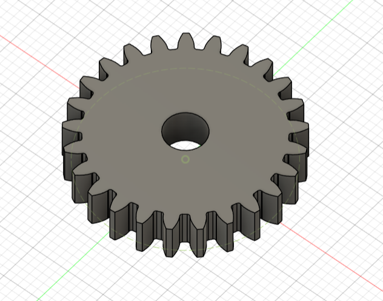 | 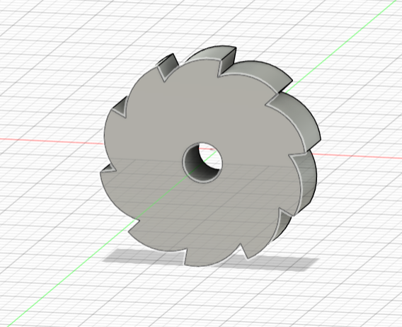 |
|:---:|:---:|
| **Third Gear:** A motion take-up gear with identical specifications to the *main gear*, but with a solid structure lacking radial slots. It functions as a mounting base and provides a rigid coupling to the ratchet mechanism. | **Ratchet:** A ratchet wheel featuring asymmetrical teeth. Its kinematic role is to convert the linear motion of the actuating lever into unidirectional rotational motion. |

| 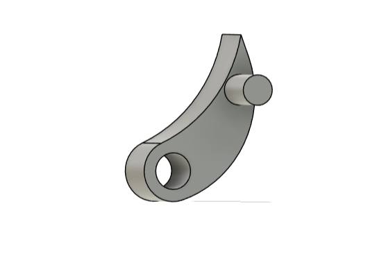 | 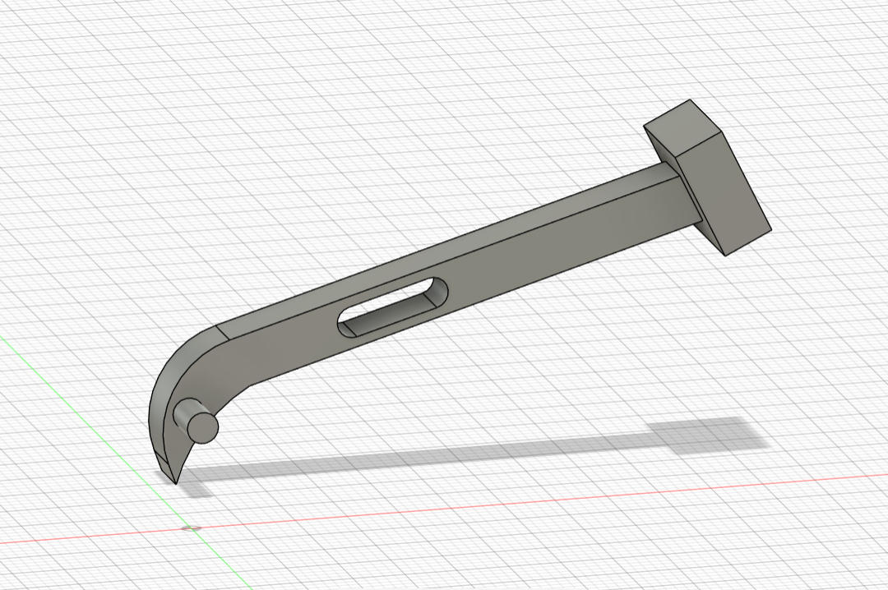 |
|:---:|:---:|
| **Pawl:** A locking and retaining detent. It acts as a travel limiter for the *ratchet*, preventing over-travel and ensuring the actuating arm retracts only after reaching the optimal angle for releasing a single flap. | **Arm Button:** A linear actuating lever that includes an interactive toothed section (rack) to engage the *ratchet*. The operable end is designed as a detachable piece, allowing the shaft to pass through the guide holes in the case during assembly. |

| 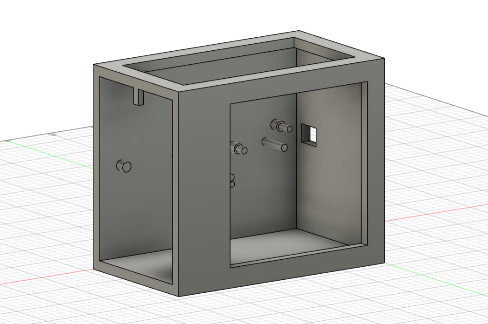 | 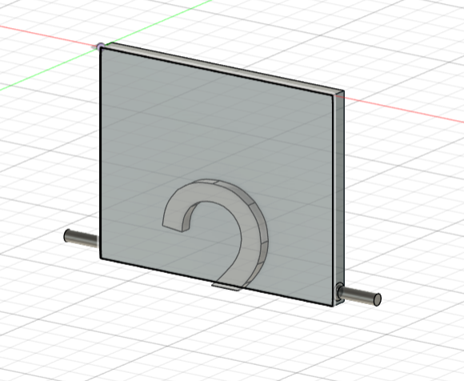  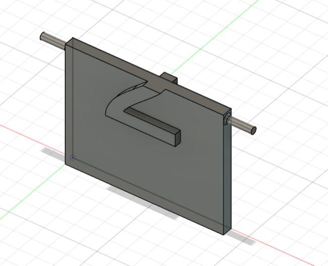
|:---:|:---:|:---:|
| **Case:** The load-bearing structure of the assembly. It integrates the bearings supporting the rotational axes of all moving parts. The design includes a geometric profile (stopper) placed in the upper section, calculated to support and lock the active flap in a vertical position. | **Flap:** A rectangular panel featuring pivots at its extremities for mechanical anchoring in the slots of the *main gear*. |

---

## Personal Touch

This project distinguishes itself from most split-flap implementations through its purely mechanical trigger approach, eliminating the reliance on electronic actuators, development boards (such as Arduino), and stepper motors found in standard models. 

The case was optimized with structural cutouts that expose the internal mechanical architecture, allowing direct observation of the gear kinematics during indexing. Furthermore, during the Fusion 360 design phase, the kinematic analysis was refined by configuring advanced motion constraints (Contact Sets and Motion Links). This allowed me to dynamically simulate the elasticity introduced by the restoring force of the tensioning rubber bands on the *pawl* system and the actuating lever.

---

## Non-Printable Objects

To complete the mechanical functionality of the system, a few external elements were required:
* **Tensioning Rubber Bands:** Small elastic bands integrated into the system to provide the necessary restoring force (return spring). They are used to bring the *arm button* back to its initial position after a press, and to maintain constant contact pressure from the *pawl* against the toothed surface of the *ratchet*.

---

## Tools Used

* Fusion 360
* GitHub
* 3D Printer
* PrusaSlicer

---

## References

* Split-flap display mechanism inspiration
* Vintage airport/train station displays
* [Fully 3D Printed Split Flap Display - Reddit](https://www.reddit.com/r/3Dprinting/comments/1jeub4g/i_designed_a_split_flap_display_fully_3d_printed/)
* [Mechanical Split Flap Inspiration - Instagram](https://www.instagram.com/p/BsODiyCHwc7/?utm_source=ig_web_copy_link&igsh=NTc4MTIwNjQ2YQ==)
